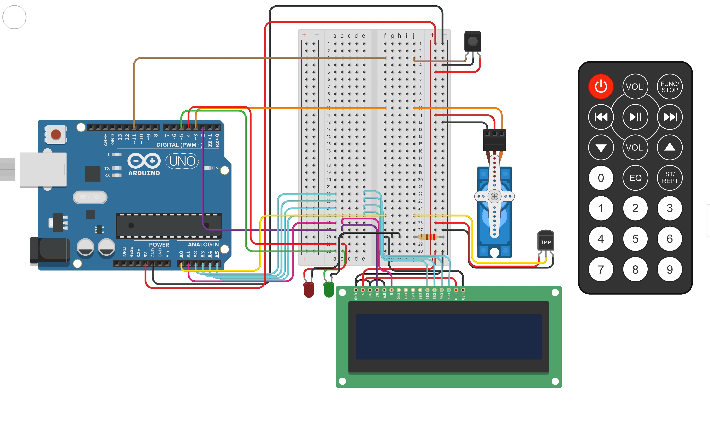
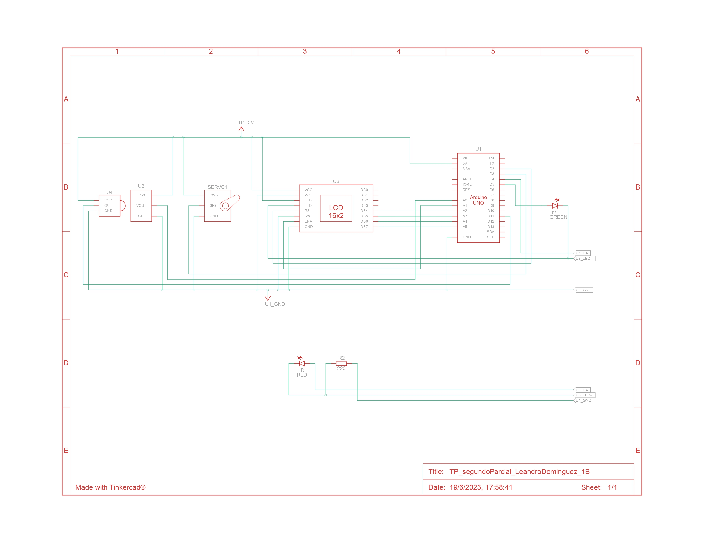

# Funcionamiento integral: Sistema de incendios

## Descripción
El proyecto consiste en un sistema de incendio utilizando Arduino que tiene como objetivo detectar cambios de temperatura, activar un servo motor en caso de detectar un incendio y rociar agua en el ambiente para detenerlo. Además, se muestra la temperatura actual y la estación del año en un display LCD.

## Diagrama esquematico

## Componentes
-  Arduino uno
:   Maneja:toda la logica del sistema.
-  Sensor de temperatura
:   Recibe la temperatura ambiente constantemente.
-  Control remoto IR
:   Maneja el funcionamiento del algoritmo de arduino. Tiene 3 botones funcionales, apagar, siguiente estación y anterior estación.

## Variables y definiciones importantes
Definiciones de los botones activos para presionar del control remoto IR
-     #define CODEOFF 0
      #define CODEBACK 4
      #define CODENEXT 6

Este enum se utiliza para definir la estación del año en la clase Estacion.
-     enum EnumEstaciones{Verano,Otonio,Invierno,Primavera};

Instancia de la clase Estacion
-     Estacion estacionDelAnio;

## Funciones

Se encarga de imprimir mensaje/s en la pantalla del LCD.
Parametros: **lcd** objeto tipo LiquidCristal, **msjArriba** Texto a imprimir en fila 0, **msjAbajo** Texto a imprimir en fila 1, **limpiar** valor booleano para indicar si se debe limpiar la pantalla antes de imprimir los mensajes.
-     void imprimirMsjEnLcd(LiquidCrystal lcd, String msjArriba, String msjAbajo, bool limpiar);

Retorna la temperatura ambiente del sensor de temperatura.
Parametros: **pinSensorTmp** pin del arduino donde está conectado el sensor de temperatura.
-     int recibirTemp(int pinSensorTmp);

Retorna el valor command del boton presionado en el control remoto IR, caso contrario -1.
Parametros: **irrecv** Objeto IRrecv de donde se obtendran los botones presionados.
-     int recibirControlRemotoIR(IRrecv irrecv);

Intercambia el valor de un tipo booleano, si es **false**, lo cambia a **true** y viceversa.
Parametros: **valor** Puntero al valor booleano a modificar.
-     void switchBooleano(bool *valor);
